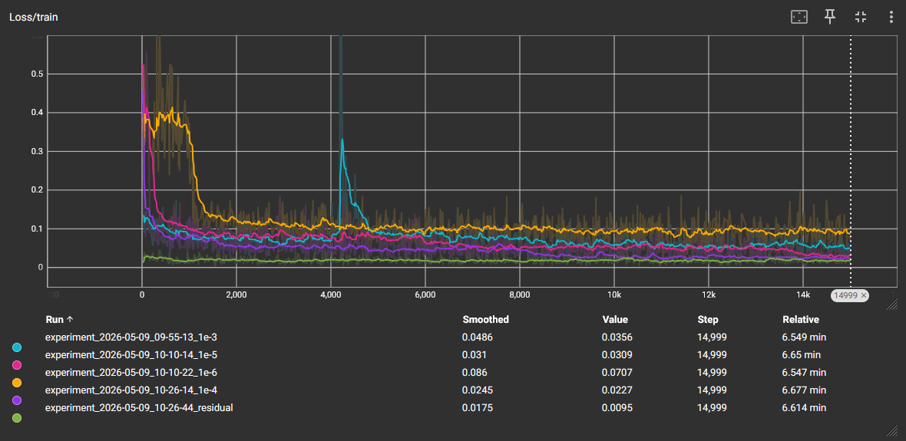
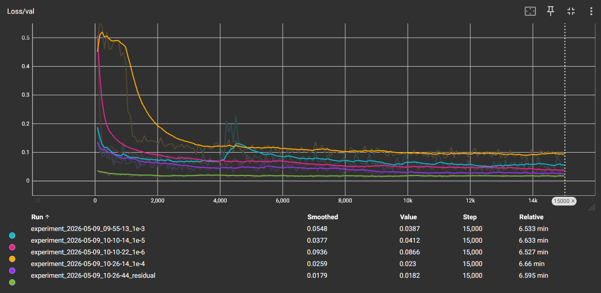
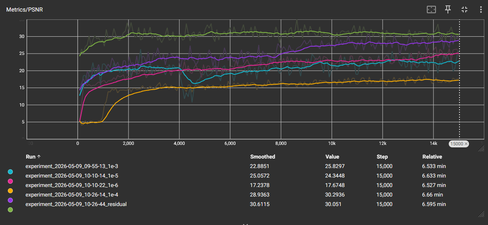
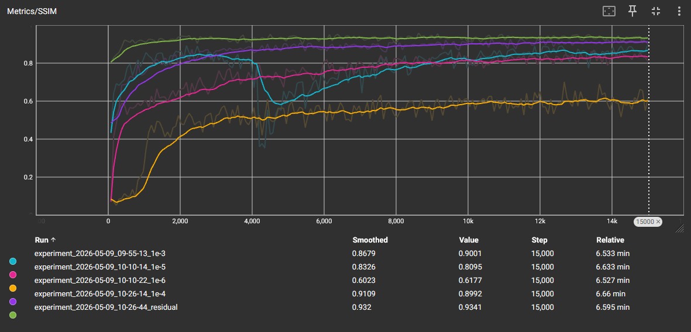
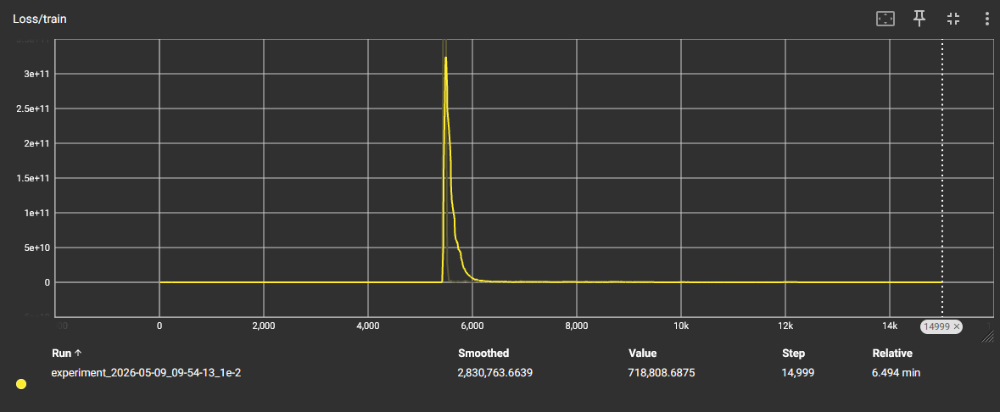
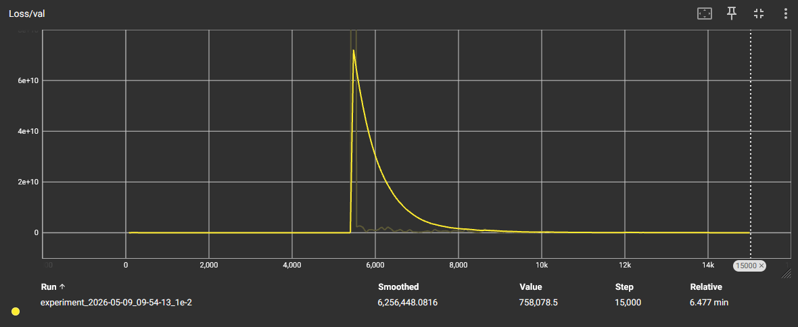
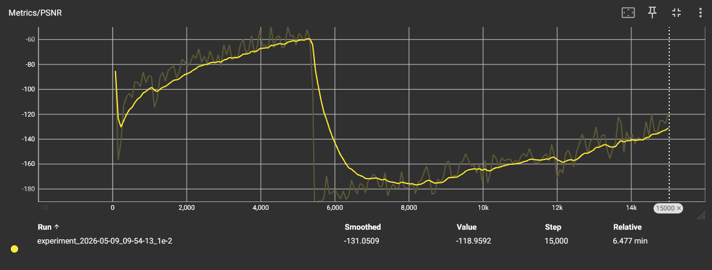
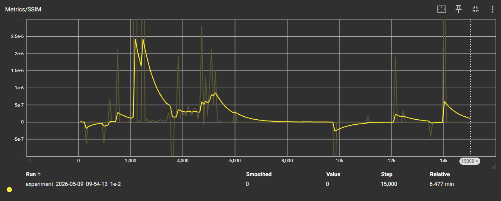

# Exercise 6 - Deep Learning

### Code
- Dataset: class `SRDataset` in `code/dataset.py`
- Basic model: class `BasicSRModel` in `code/sr_model.py`
- Residual model: class `ResSRModel` in `code/res_model.py`

Executing both `sr_model.py` and `res_model.py` will print the number of parameters in the models.

- Training: file `code/train.py`. Can be given a `--model` argument which can either be `basic` or `residual`. This will start training and will write the model to disk every 50 epochs. The models are saved in `checkpoints/{run name}/model.pth`. The training process can be monitored with `tensorboard --logdir runs`.
- Evaluation: file `code/eval.py`. It will evaluate the model and print its PSNR and SSIM scores. It can be given two arguments to select the model:
  - `--run`: the name of the run folder in `./checkpoints/`
  - `--checkpoint`: the name of the model in that run. Defaults to `model.pth`, which is the final model after training.
  - Example: `python code/eval.py --run 2026-05-09_10-26-44 --checkpoint checkpoint_150.pth`
- An additional inference script in the file `code/inference.py`, which can be given the arguments `--run` and `--checkpoint` to select the model, and `--image` and `--output`. Example: `python code/inference.py --run 2026-05-09_10-26-44 --checkpoint checkpoint_150.pth --image data/eval/0000.png --output upscaled.png`

### Models
Models are trained for 200 epochs.

#### Train L1 loss (per iteration)

#### Validation L1 loss (per epoch)

#### PSNR (per epoch)

#### SSIM (per epoch)

The above graphs only show the basic model with learning rates `1e-3`, `1e-4`, `1e-5` and `1e-6`, and the residual models with learning rate `1e-4`.

As can be seen, the residual model (with learning rate `1e-4`) outperforms all other models, and converges much faster. The basic model with learning rate `1e-4` performs well and comes second across all metrics.

The basic model with learning rate `1e-2` is omitted, as its performance is extremely poor and does not converge at all. Its metrics are shown below.

#### `1e-2` model train loss

#### `1e-2` model validation loss

#### `1e-2` model PSNR

#### `1e-2` model SSIM

The model completely diverges, with the training loss increasing to very high values and the validation loss, PSNR and SSIM are extremely low. This is expected, as a learning rate of `1e-2` is too high for this model and causes it to diverge.

### Numerical results
Models are sorted by PSNR (and equivalently by SSIM)
| Model                | PSNR       | SSIM      |
| -----                | ----       | ----      |
| Residual (lr = 1e-4) | 28.26 dB   | 0.9154    |
| Basic (lr = 1e-4)    | 27.27 dB   | 0.8865    |
| Basic (lr = 1e-3)    | 25.16 dB   | 0.8697    |
| Bicubic              | 25.07 dB   | 0.8390    |
| Basic (lr = 1e-5)    | 24.49 dB   | 0.8234    |
| Bilinear             | 23.82 dB   | 0.7874    |
| Basic (lr = 1e-6)    | 17.46 dB   | 0.5557    |
| Basic (lr = 1e-2)    | -119.75 dB | 0.0000    |

# Visual results
Original castle image:

Upscaled image with the basic model (learning rate `1e-4`):

Upscaled image with the residual model (learning rate `1e-4`):

